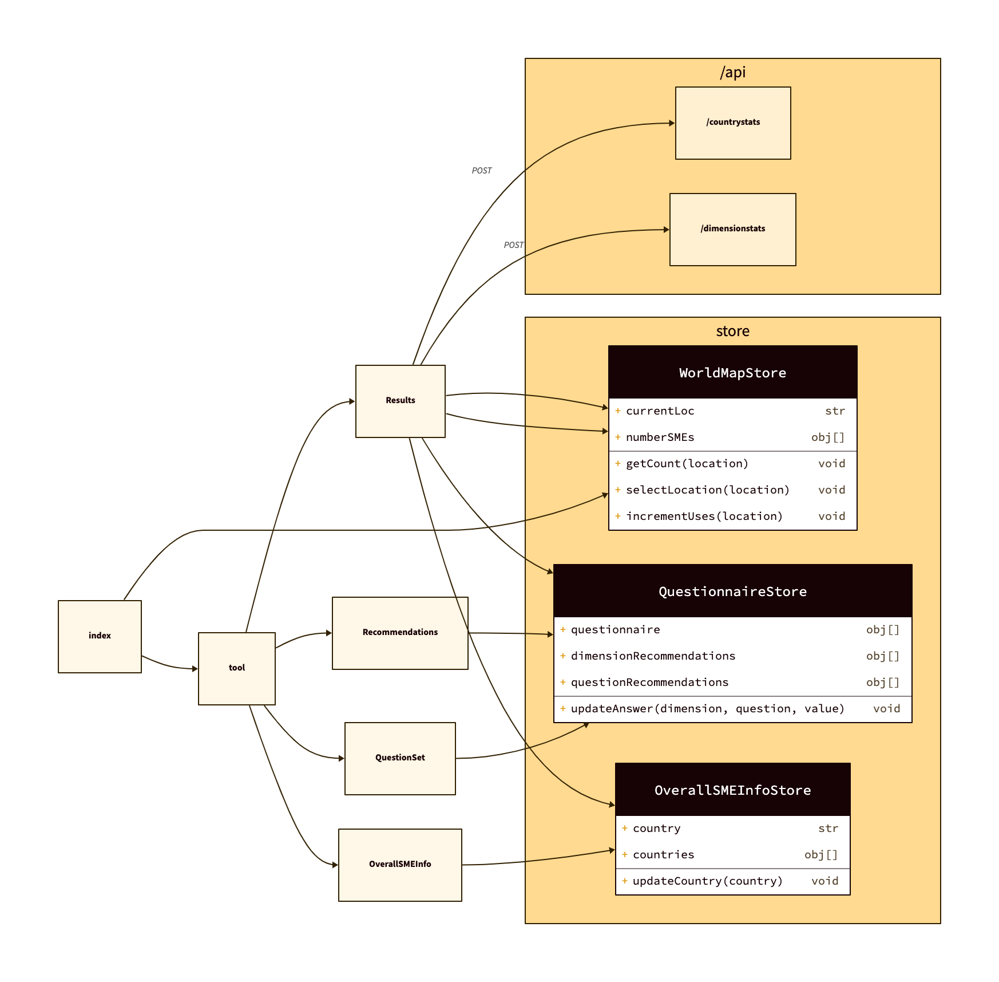

# Design notes

## Main dependencies

The tool is a [Next.js](https://nextjs.org/) 12 application, and the overall UI state is maintained using [zustand](https://github.com/pmndrs/zustand) stores.

UI components come from the following libraries:
- Many of them come from the [grommet](https://v2.grommet.io/) UI framework, including the `WorldMap` used in the index, and layout components as `Box`, `Tab`, `Accordion`, ....
- The questions are displayed using the `Likert` component from [react-likert-scale](https://www.npmjs.com/package/react-likert-scale).
- The results are showed using the `Radar` component from [nivo](https://nivo.rocks/).

## Overall code structure
The following diagram shows an excerpt of the code organization.

At the left, we can see the pages:
- `index` : the index page with the `WorldMap`
- `tool` : just the arrangement of the different `Tabs` that organize the tool.

Then in the tabs of the `tool` we have the actual structure:
- `OverallSMEInfo` just allows the selection of the country of the SME, and is separated for future extensions to collect some other info.
- `QuestionSet` shows the questions for each of the dimensions of the questionnaire.
- `Recommendations` shows an `Accordion` with the recommendations, updated dynamically when the answers to the questions change.
- `Results` shows a `Radar` with the current scores from the answers to the questions, and allows to submit the info.

The submission of the questionnaire accesses the `/api` to update just the following:
- The counting of SMEs that have used the tool per country, using `/api/countrystats`
- The average scores per dimension, using `api/dimensionstats`.

## Persistence

The only persistent state stored are the countings and averages submitted in the `Results` component. Persistence is simple JSON file writing, no databases or other kind of serverside mechanisms used. This is of course just a simple hack to account for simple usage.

## Authentication

No authentication mechanisms, a deployment of the tool is accessible from anywhere to anybody. You should integrate the tool with your authentication system for organizational usage.
